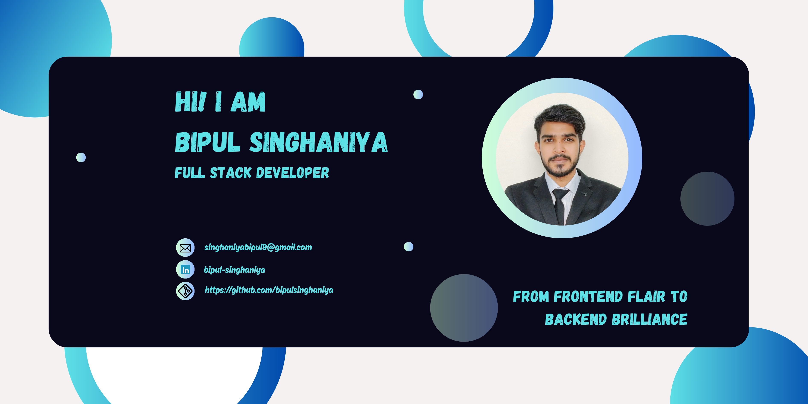

I'm a passionate developer always looking to learn and grow. Here's a little about me:

## 🚀 About Me
- 🌱 I’m currently learning Backend Development
- 👯 I’m looking to collaborate
- 💬 Ask me about Full Stack Web Development
## 🛠️ Technologies & Tools

  
  
  
  
  
  
  
  
  
  
  <!--  -->
  
  
  
  
  

## 📈 GitHub Stats

  

  

## 🧠 LeetCode Stats
<table>
  <tr>
    <td>
      
    </td>
    <td align="center">
       
    </td>
  </tr>
</table>

## 🔗 Connect with Me

  

  

  

  

  

## ⚡ Fuel the Creativity

  

  If you found something helpful, consider <strong>starring</strong> the project ⭐  

---

